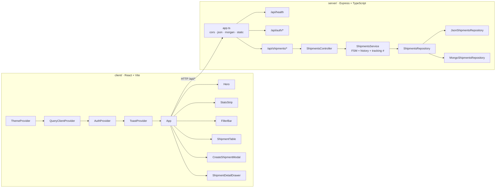
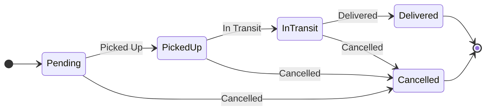

<div align="center">

# Samex.Delivery — Shipment Tracker

**A focused, production-shaped slice of a B2B logistics platform.**
One screen for dispatchers — list shipments, advance status through a server-enforced state machine, audit every handover end to end.

<br/>


<br/>

<sub><b>Live preview</b> · Render (API) + Vercel (UI) · see [Deployment](#deployment) for live URLs</sub>
<br/>
<sub><b>Demo credentials</b> · <code>admin</code> / <code>samex2026</code></sub>

</div>

---

<div align="center">

[Highlights](#highlights) · [Quick start](#quick-start) · [Architecture](#architecture) · [State machine](#status-state-machine) · [API](#api-reference) · [Frontend](#frontend-feature-tour) · [Configuration](#configuration) · [Deployment](#deployment) · [Roadmap](#what-id-build-next) · [Docs](#documentation)

</div>

---

## Highlights

| | |
|---|---|
| **End-to-end working slice** | UI talks to API talks to storage and back. Create a shipment, advance its status, watch the timeline update in real time. |
| **Server-authoritative FSM** | Illegal transitions (`Pending → Delivered`) are rejected with `409 Conflict`. The UI mirrors the machine only so it never offers an option the server would refuse. |
| **Layered backend** | `route → controller → service → repository`. Every business rule lives in the service; the repository hides storage entirely. |
| **Swappable storage** | JSON file by default (zero setup), MongoDB by setting `MONGODB_URI`. Service code never knows. |
| **Polished frontend** | React + Vite + TypeScript + Tailwind. Framer Motion choreography, Recharts data viz, full light/dark/system theme, 220ms cross-fade theme transitions. |
| **Auth gate** | JWT-protected mutations (`POST`, `PATCH`, `DELETE`); reads open so dashboards render on first load and `curl` works without a token. |
| **Documented end to end** | This README + a deep interview Q&A bank + an honest AI workflow note. |

---

## Quick start

> Requires **Node ≥ 18.17**. No database setup needed — the default JSON store is committed seed data.

```bash
# 1. Install
npm install

# 2. Configure (uses sensible defaults out of the box)
cp server/.env.example server/.env

# 3. Run both server and client
npm run dev
```

| Service | URL |
|---|---|
| Web UI | `http://localhost:5173` |
| API | `http://localhost:4000` |

The Vite dev server proxies every `/api/*` request to Express on port 4000, so the client code is origin-agnostic in dev and prod.

<details>
<summary><b>Other scripts</b></summary>

```bash
npm run build    # type-check + build both server and client
npm start        # run the compiled server
npm run seed     # restore the JSON store from the committed seed
```

The root `dev` script uses `concurrently` to colour-code server and client logs side by side. `build` feeds both `tsc` (server) and `vite build` (client).

</details>

---

## Architecture

Three rules govern the structure:

1. **The server is the source of truth for state.** Status transitions are validated server-side; the UI's view of the FSM exists only for UX.
2. **Layers talk one way only.** Routes call controllers, controllers call services, services call repositories. Never sideways.
3. **Storage is a swappable adapter.** The service has no idea whether reads and writes hit a JSON file or MongoDB.



### Backend layout

| Path | Purpose |
|---|---|
| `server/src/index.ts` | Boot entrypoint |
| `server/src/app.ts` | Express assembly, middleware, optional static-serve of `client/dist` |
| `server/src/config/env.ts` | Typed environment loader (fail-fast on missing) |
| `server/src/middleware/` | `auth.ts`, `validate.ts`, `error.ts` |
| `server/src/routes/` | `shipments.routes.ts`, `auth.routes.ts` |
| `server/src/controllers/` | Thin HTTP adapters — no business logic |
| `server/src/services/shipments.service.ts` | FSM enforcement, history appends, tracking-number generation |
| `server/src/repositories/` | `ShipmentsRepository` interface + JSON + Mongo implementations |
| `server/src/models/shipment.model.ts` | Mongoose schema (only loaded when `MONGODB_URI` set) |
| `server/src/schemas/shipment.schema.ts` | Zod request schemas — single source of types via `z.infer` |
| `server/src/utils/` | `statusMachine.ts`, `trackingNumber.ts` |
| `server/data/shipments.json` | 8 committed seed shipments |

### Frontend layout

| Path | Purpose |
|---|---|
| `client/src/main.tsx` | Provider tree: Theme → QueryClient → Auth → Toast → App |
| `client/src/App.tsx` | Composition root + page-level state (search, status, modal, drawer) |
| `client/src/api/` | `client.ts` (fetch helper + token), `shipments.ts`, `auth.ts` |
| `client/src/context/` | `ThemeContext`, `AuthContext`, `ToastContext` |
| `client/src/hooks/useShipments.ts` | TanStack Query hooks with cache invalidation |
| `client/src/components/Header.tsx` | Sticky nav + theme toggle + auth pill |
| `client/src/components/Hero.tsx` | Gradient banner, animated truck on SVG path, live counter |
| `client/src/components/StatsStrip.tsx` | Six clickable tiles with sparklines + donut chart |
| `client/src/components/FilterBar.tsx` | Search + status chip row |
| `client/src/components/ShipmentTable.tsx` | Motion list, hash-avatars, copyable IDs, inline status dropdown |
| `client/src/components/ShipmentDetailDrawer.tsx` | Slide-in drawer with route card, meta grid, timeline |
| `client/src/components/CreateShipmentModal.tsx` | Form with gradient header, inline errors, confetti on success |
| `client/src/components/LoginPage.tsx` | Split-screen brand + form |
| `client/src/components/ThemeToggle.tsx` | Light / Dark / System single-button cycle |
| `client/src/components/AnimatedNumber.tsx` | Spring-eased count-up |
| `client/src/components/ScrollProgress.tsx` | Top-of-page progress bar driven by `useScroll` |
| `client/src/components/StatusBadge.tsx`, `StatusDropdown.tsx`, `RouteVisual.tsx`, `CopyButton.tsx`, `EmptyState.tsx`, `TableSkeleton.tsx` | Primitive UI pieces |

### Request flow

A click on "Advance status → Picked Up" travels:

```
StatusDropdown → App.handleAdvance → useUpdateStatus (TanStack Query)
              → shipmentsApi.updateStatus
              → fetch PATCH /api/shipments/:id/status
              → Vite proxy / Render
              → Express middleware (cors, json, morgan)
              → requireAuth (verifies JWT, attaches req.auth)
              → validateBody(updateStatusSchema)
              → ShipmentsController.updateStatus
              → ShipmentsService.updateStatus
                  ↳ FSM check (canTransition)
                  ↳ append history entry
                  ↳ persist via repository
              → JSON response
              → React Query invalidates ['shipments'] + ['shipments','stats']
              → table row re-renders, toast fires, drawer timeline updates
```

---

## Status state machine



- The authoritative adjacency map lives in `server/src/utils/statusMachine.ts`.
- Illegal transitions throw a typed `InvalidTransitionError` that the error middleware maps to `HTTP 409 Conflict` with `{ from, to }` in the body.
- The same transitions are mirrored in `client/src/types/shipment.ts` so the "Advance status" dropdown only ever offers a legal next state.
- `Cancelled` is a parallel terminal sink, not a continuation — it represents abandonment, not progress.

---

## API reference

| Method | Path | Auth | Description |
|---|---|---|---|
| `GET` | `/api/health` | — | Liveness probe; reports active storage backend |
| `POST` | `/api/auth/login` | — | Exchange credentials for a JWT |
| `GET` | `/api/auth/me` | yes | Return the authenticated user |
| `GET` | `/api/shipments` | — | List all shipments, newest first |
| `GET` | `/api/shipments/stats` | — | Counts per status |
| `GET` | `/api/shipments/:id` | — | Single shipment with history |
| `POST` | `/api/shipments` | yes | Create a shipment (status defaults to `Pending`) |
| `PATCH` | `/api/shipments/:id/status` | yes | Advance status (FSM-enforced) |
| `DELETE` | `/api/shipments/:id` | yes | Delete a shipment |

Reads stay open so curl-based grading is friction-free and the dashboard renders on first load. Flipping reads to also require auth is a one-line change in `server/src/routes/shipments.routes.ts`.

<details>
<summary><b>Curl playbook</b></summary>

```bash
# Login
TOKEN=$(curl -s -X POST http://localhost:4000/api/auth/login \
  -H 'Content-Type: application/json' \
  -d '{"username":"admin","password":"samex2026"}' | jq -r .token)

# Create
curl -s -X POST http://localhost:4000/api/shipments \
  -H "Authorization: Bearer $TOKEN" \
  -H 'Content-Type: application/json' \
  -d '{"sender":"Acme","receiver":"Bob","origin":"Mumbai","destination":"Delhi"}' | jq

# Advance status (legal)
curl -s -X PATCH http://localhost:4000/api/shipments/<id>/status \
  -H "Authorization: Bearer $TOKEN" \
  -H 'Content-Type: application/json' \
  -d '{"status":"Picked Up","note":"loaded on truck"}' | jq

# Illegal transition returns 409 InvalidTransition
curl -i -X PATCH http://localhost:4000/api/shipments/<id>/status \
  -H "Authorization: Bearer $TOKEN" \
  -H 'Content-Type: application/json' \
  -d '{"status":"Delivered"}'
```

</details>

<details>
<summary><b>Error shapes</b></summary>

Validation:

```json
{
  "error": "ValidationError",
  "message": "Invalid request body",
  "details": { "sender": ["Must be at least 2 characters"] }
}
```

Status conflict:

```json
{
  "error": "InvalidTransition",
  "message": "Invalid status transition: Pending → Delivered",
  "from": "Pending",
  "to": "Delivered"
}
```

</details>

---

## Frontend feature tour

### Theme system
- Light / Dark / System modes with a single-button cycle in the header.
- Preference persisted to `localStorage`, reactive to OS-level `prefers-color-scheme` changes.
- 220ms cubic-bezier transition on every color / background / border / fill / stroke — theme switches feel like a single fluid motion.

### Hero
- Animated truck travels along a curved SVG motion path on an 8-second loop, driven by `useAnimationFrame` + `path.getPointAtLength`.
- Live indicator with a pulsing dot and a time-aware greeting (Good morning / afternoon / evening).
- "In motion" counter uses `AnimatedNumber` for a count-up effect.

### Stats grid
- Six clickable tiles (Total, In motion, plus one per status) with icon, animated count-up, and a 14-bucket gradient-fill sparkline derived from each shipment's audit history.
- Donut chart of status distribution. Clicking a slice or legend row filters the table and smooth-scrolls into view.
- Stat tiles double as filter shortcuts — click "Pending", see only Pending shipments.

### Filter bar
- Search by tracking number, sender, receiver, origin, destination.
- Status chip row (single-select), with an "All" chip and an inline "Clear filters" shortcut once a filter is active.

### Shipments list
- Card-list layout (not a dense HTML table), each row breathes.
- Deterministic colored avatar per sender (hash-based palette).
- Inline copyable tracking number, route visual with a dashed-arc SVG between origin and destination, status badge with status icon.
- Per-row stagger fade-in on mount via Framer Motion's `AnimatePresence`; reveal-on-hover detail arrow; animated insert/remove.
- Inline "Advance status" dropdown so dispatchers don't need to open a modal.

### Detail drawer
- Slides in from the right with a spring transition; backdrop blurs the page behind.
- Sticky header with tracking number, copy button, parties, medium-size status badge.
- Route card (vertical From → To with dashed connector), meta grid, brand-accented "Advance status" panel.
- Timeline: each entry is a colored node with the matching status icon, exact timestamp, and an optional note bubble.

### Create modal
- Gradient header banner, inline validation errors, `canvas-confetti` burst on success.
- Status defaults to `Pending`; the tracking number is generated server-side and shown immediately in the table.

### Toasts
- White cards with status-color ring and matching icon, slide in from the right, auto-dismiss after 4.2s.

### Login
- Split-screen on desktop: gradient brand panel + feature list on the left, clean form panel on the right.
- Demo credentials pre-filled and shown as a hint.

### Performance and accessibility
- Loading skeletons with a shimmer keyframe.
- `prefers-reduced-motion` respected globally (transitions disabled, confetti suppressed).
- Semantic HTML, ARIA labels on icon-only buttons, focus rings tinted with the brand color, color-blind-friendly status palette.

---

## Configuration

### Server (`server/.env`)

| Variable | Default | Purpose |
|---|---|---|
| `PORT` | `4000` | Listen port |
| `NODE_ENV` | `development` | Standard Node env flag |
| `CLIENT_ORIGIN` | `*` | CORS allowlist, comma-separated origins |
| `AUTH_USERNAME` | `admin` | Single user gating mutations |
| `AUTH_PASSWORD` | `samex2026` | Single user gating mutations |
| `JWT_SECRET` | _dev-only fallback_ | HS256 signing secret — set in production |
| `JWT_EXPIRES_IN` | `24h` | Token lifetime |
| `MONGODB_URI` | _empty_ | Set to swap from JSON file to MongoDB |

### Client (`client/.env`)

| Variable | Default | Purpose |
|---|---|---|
| `VITE_API_BASE_URL` | _empty_ | Set in production to point at the deployed API |

In local dev, `VITE_API_BASE_URL` stays empty and the Vite proxy handles `/api/*` so the client code is origin-agnostic.

---

## Project layout

```
.
├── README.md                  this file
├── render.yaml                API service blueprint (Render)
├── package.json               workspaces root
├── server/
│   ├── .env.example
│   ├── data/shipments.json    8 committed seed shipments
│   └── src/
│       ├── index.ts           entrypoint
│       ├── app.ts             Express assembly + middleware
│       ├── config/env.ts      typed environment loader
│       ├── middleware/        auth, validate, error
│       ├── routes/            /shipments, /auth
│       ├── controllers/       thin HTTP adapters
│       ├── services/          business rules (FSM, history)
│       ├── repositories/      JSON + Mongo behind one interface
│       ├── models/            Mongoose schema (Mongo path only)
│       ├── schemas/           Zod request schemas
│       ├── utils/             statusMachine, trackingNumber
│       └── seed.ts            restore runtime store from seed
└── client/
    ├── vercel.json            SPA preset + rewrites
    ├── .env.example
    └── src/
        ├── main.tsx           provider tree
        ├── App.tsx            composition root
        ├── api/               fetch client, shipments, auth
        ├── context/           Theme, Auth, Toast
        ├── hooks/             TanStack Query hooks
        ├── components/        Header, Hero, Stats, Filter,
        │                      Table, Drawer, Modal, Login,
        │                      Badge, Dropdown, Toggle, etc.
        ├── types/             shared shipment types
        └── utils/             date formatters
```

---

## Deployment

The fastest free path is **Render** for the API and **Vercel** for the UI. The repo ships with `render.yaml` and `client/vercel.json` so both platforms read the right configuration automatically — the only manual work is setting environment variables in their dashboards.

> Total time: about **7 minutes** end to end.

### Part 1 — API on Render

1. Open <https://render.com> → **Sign in with GitHub**.
2. **Add new +** → **Web Service**.
3. Connect repository → select this repo → **Connect**.
4. Render reads `render.yaml` and pre-fills the form. Click **Deploy Web Service**.
5. Wait ~3 min until status = **Live**. Copy the public URL.

Render form values (already configured by `render.yaml` — shown for transparency):

| Field | Value |
|---|---|
| Branch | `main` |
| Root Directory | _empty_ |
| Runtime | `Node` |
| Build Command | `NODE_ENV=development npm install --include=dev && npm run build -w server` |
| Start Command | `npm run start -w server` |
| Instance Type | `Free` |
| Health Check Path | `/api/health` |

Environment variables:

| Key | Value |
|---|---|
| `NODE_VERSION` | `20.18.0` |
| `NODE_ENV` | `production` |
| `AUTH_USERNAME` | `admin` |
| `AUTH_PASSWORD` | `samex2026` |
| `JWT_SECRET` | _generate a 64+ char random hex string_ |
| `JWT_EXPIRES_IN` | `24h` |
| `CLIENT_ORIGIN` | `*` |

> The `NODE_ENV=development` override in the build command is intentional. Render sets `NODE_ENV=production` at the service level, which makes `npm install` skip devDependencies — including TypeScript itself. Forcing the build env to `development` and passing `--include=dev` keeps `tsc` available.

Sanity check:
```bash
curl https://<your-app>.onrender.com/api/health
# → {"status":"ok","storage":"json",...}
```

### Part 2 — UI on Vercel

1. Open <https://vercel.com> → **Continue with GitHub**.
2. **Add New** → **Project** → import this repo.
3. **Root Directory** → click **Edit** → select `client` → **Continue**.
4. Vercel auto-detects **Vite**. Leave the rest — `client/vercel.json` overrides what matters.
5. Expand **Environment Variables**:
   - Name: `VITE_API_BASE_URL`
   - Value: your Render URL from Part 1 (no trailing slash)
   - Click **Add**.
6. **Deploy**. Wait ~1 min. Copy the Vercel URL.

### Part 3 — Test live

Open the Vercel URL. The dashboard loads with 8 seed shipments + stats. Sign in with `admin` / `samex2026`. Create a shipment, advance its status, open the drawer to see the timeline.

> Submit the **Vercel URL** + **GitHub URL**.

### Notes

- **Render free tier sleeps** after ~15 min of inactivity; first request after sleep takes ~30 s.
- **Filesystem is ephemeral** on Render free — JSON data resets on every restart. For real persistence, set `MONGODB_URI` in the Render env vars to a free [MongoDB Atlas](https://www.mongodb.com/cloud/atlas/register) cluster.
- **CORS** defaults to `*`. Tighten to your Vercel URL in production.
- **TypeScript pinned to 5.4.5** in `server/package.json` to stay before the `moduleResolution: "node"` deprecation that turns into an error on some build environments.

### Alternative — single platform

The Express server already serves `client/dist` from the same process if it finds it, so a single-platform deploy (Railway, Fly, Docker, self-hosted VM) is one `npm run build && npm start` away. Use this when you want a single URL and zero CORS surface.

---

## What I'd build next

In priority order:

1. **Tests** — Vitest + Supertest covering the FSM, validation, auth gates, and the repository pattern. The FSM is the highest-value target.
2. **Optimistic UI** for status advances, with typed rollback on `409 InvalidTransition`.
3. **Server-side filtering and pagination** — `GET /api/shipments?status=&q=&cursor=` for when the list grows past a few hundred.
4. **Real users** — users collection, bcrypt, refresh-token rotation, password reset.
5. **Roles** — `admin`, `dispatcher`, `customer`, per-shipment ACLs.
6. **Real-time** — Socket.IO emitted from the service layer, the UI subscribes for live row insertions.
7. **Webhooks** — `POST /api/shipments/:id/events` for partner carriers, HMAC-signed.
8. **Observability** — pino structured logs, request IDs, Prometheus `/metrics`.
9. **CI** — lint, type-check, build, test on every push; auto-deploy on green.
10. **A real map** — Leaflet route arc with an animated truck at the current progress.


---

<div align="center">
<sub>Internal demo build · no license · built with care.</sub>
</div>

